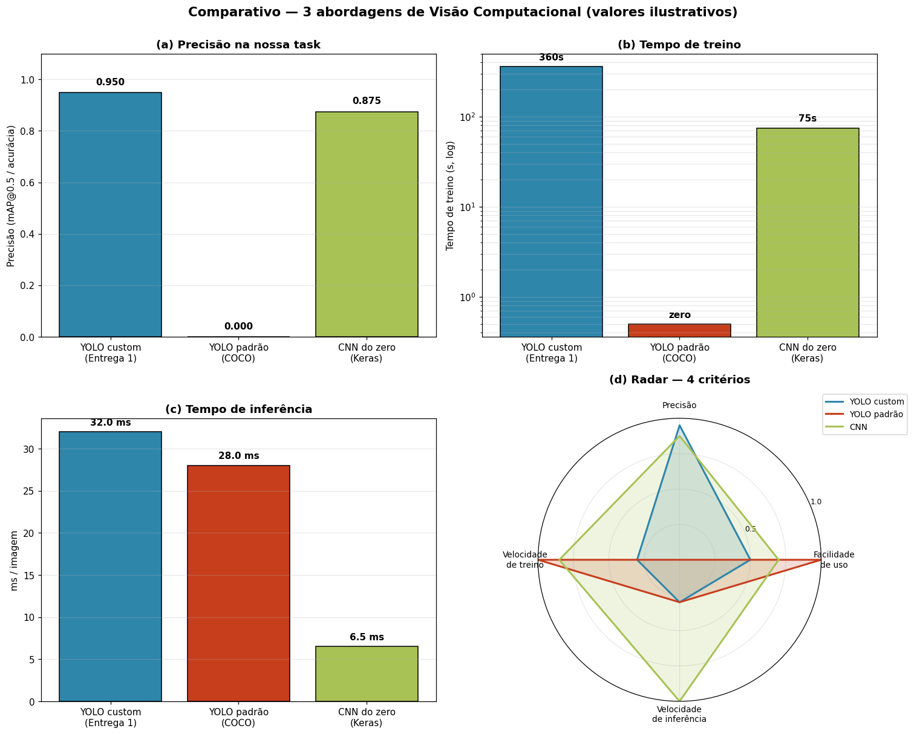

 <a href="https://www.fiap.com.br/">
  
</a>

<br>

# Cap 1 - O despertar da Rede Neural

## 👨‍💻 Grupo 10
**Curso:** 1TIAOS – Fase 6

## 👨‍🎓 Integrantes
- [**Silvio Prestes Guerreiro Junior**](https://www.linkedin.com/in/silvio-guerreiro-junior/)
- **RM:** 567958

## 👩‍🏫 Professores
- **Tutor(a):** [Sabrina Otoni](https://www.linkedin.com/company/inova-fusca)
- **Coordenador(a):** [André Godoi Chiovato](https://www.linkedin.com/company/inova-fusca)


> Demonstração para o cliente fictício **FarmTech Solutions** de um sistema de visão computacional capaz de reconhecer dois objetos visualmente distintos em imagens. O projeto está dividido em duas entregas que conversam entre si: a primeira customiza um modelo YOLOv5 para nossas classes; a segunda compara essa solução contra duas abordagens "concorrentes" (YOLO padrão sem fine-tuning e CNN treinada do zero).

---

## Como navegar este repositório

Este README é apenas a **porta de entrada**. Toda a documentação técnica — passo a passo, decisões de projeto, código comentado, resultados numéricos e conclusões — está dentro dos dois notebooks Jupyter abaixo, prontos para abrir no Google Colab:

- **Entrega 1 — YOLOv5 customizado:** [`SilvioPrestesGuerreiroJunior_rm567958_pbl_fase6.ipynb`](./SilvioPrestesGuerreiroJunior_rm567958_pbl_fase6.ipynb)
- **Entrega 2 — Comparativo entre 3 abordagens:** [`SilvioPrestesGuerreiroJunior_rm567958_pbl_fase6_entrega2.ipynb`](./SilvioPrestesGuerreiroJunior_rm567958_pbl_fase6_entrega2.ipynb)

Cada notebook contém células de markdown explicando o racional de cada etapa e células de código executadas com suas saídas. **Para entender a solução completa, abra os notebooks.**

---

## Objetos do dataset

| Classe | ID | Treino | Validação | Teste | Descrição |
|---|---|---|---|---|---|
| `perfume` | `0` | 32 | 4 | 4 | Frasco de vidro vertical, reflexivo |
| `maquina_cabelo` | `1` | 32 | 4 | 4 | Máquina de cortar cabelo (horizontal, plástico fosco, com fio) |
| **Total** | — | **64** | **8** | **8** | **80 imagens** |

A diferença visual entre os dois objetos (orientação, material, tamanho) cria um problema bem condicionado — apropriado para mostrar tanto o YOLO quanto a CNN em ação sem ambiguidade entre classes.

A configuração YOLOv5 do dataset (caminhos das pastas de treino/validação e mapeamento de classes) está em [`dataset/data.yaml`](./dataset/data.yaml). As 80 imagens organizadas em `dataset/images/{train,val,test}/` e os respectivos labels no formato YOLO em `dataset/labels/{train,val}/` ficam armazenados no Google Drive (não versionados no GitHub para não inflar o repositório).

---

## Entrega 1 — YOLOv5 customizado (transfer learning)

> **Pergunta de pesquisa:** dado um dataset pequeno de duas classes específicas, conseguimos treinar um detector confiável a partir de pesos pré-treinados em COCO?

Partimos do `yolov5s.pt` (backbone com ~7M parâmetros pré-treinado em 80 classes COCO) e fizemos **fine-tuning** com nossas 64 imagens de treino. Para isolar o efeito do tempo de treino, executamos **dois experimentos com hiperparâmetros idênticos exceto o número de épocas: 30 e 60**.

Todo o passo a passo — montagem do Drive, validação do dataset, geração do `data.yaml`, treino, validação comparativa, inferência nas imagens de teste e conclusão para o cliente — está documentado e executado em **[`SilvioPrestesGuerreiroJunior_rm567958_pbl_fase6.ipynb`](./SilvioPrestesGuerreiroJunior_rm567958_pbl_fase6.ipynb)**.

---

## Vídeo de demonstração

Demonstração de até 5 minutos do funcionamento do projeto:

**▶️ [Assista no YouTube (não listado)](https://youtu.be/CDVI2gdkW68)**

> _Substitua o link acima após gravar e publicar o vídeo._

---


## Entrega 2 — Comparativo entre 3 abordagens

> **Pergunta de pesquisa:** o YOLO customizado é mesmo a melhor escolha pro nosso problema, ou existe abordagem mais simples (sem fine-tuning) ou mais leve (CNN do zero) que entregaria valor parecido?

| Abordagem | O que faz | Origem |
|---|---|---|
| **A. YOLO custom** | Detecção (bbox + classe) com fine-tuning das nossas 64 imagens | Entrega 1 |
| **B. YOLO padrão (COCO)** | Detecção pré-treinada nas 80 classes do COCO, **sem fine-tuning** | Entrega 2 |
| **C. CNN do zero** | Apenas classificação binária (qual classe é a imagem) | Entrega 2 |

A comparação é feita nos 4 critérios pedidos pelo enunciado: **facilidade de uso, precisão, tempo de treino, tempo de inferência**.

Toda a implementação, execução, avaliação crítica e tabela final "quando usar o quê" estão em **[`SilvioPrestesGuerreiroJunior_rm567958_pbl_fase6_entrega2.ipynb`](./SilvioPrestesGuerreiroJunior_rm567958_pbl_fase6_entrega2.ipynb)**.

### Prévia visual do comparativo

Painel consolidado com os 4 critérios do enunciado (gerado pelo notebook da Entrega 2):



Os gráficos individuais (precisão, tempo de treino em escala log, tempo de inferência e radar com os 4 critérios normalizados) estão em [`assets/`](./assets/), e os artefatos visuais específicos da Entrega 2 (curvas de treino da CNN, predições nas imagens de teste e detecções do YOLO padrão) ficam em [`entrega2/`](./entrega2/).

---

## Estrutura do repositório

```
.
├── README.md                                                            ← você está aqui
│
├── SilvioPrestesGuerreiroJunior_rm567958_pbl_fase6.ipynb                ← Entrega 1 (YOLO custom)
├── SilvioPrestesGuerreiroJunior_rm567958_pbl_fase6_entrega2.ipynb       ← Entrega 2 (comparativo)
│
├── assets/                                                              ← gráficos comparativos consolidados
│   ├── chart_a_precisao.png
│   ├── chart_b_tempo_treino.png
│   ├── chart_c_tempo_inferencia.png
│   ├── chart_d_radar.png
│   └── chart_panel_consolidado.png
│
└── entrega2/                                                            ← saídas visuais da Entrega 2
    ├── charts/                                                          ← gráficos comparativos detalhados
    ├── yolo_coco/                                                       ← detecções do YOLO padrão (COCO)
    ├── cnn_curves.png                                                   ← curvas de treino da CNN
    ├── cnn_test_predictions.png                                         ← predições da CNN no teste
    ├── comparativo_grafico.png                                          ← gráfico comparativo das 3 abordagens
    └── yolo_coco_detections.png                                         ← exemplo de detecções YOLO padrão
```
